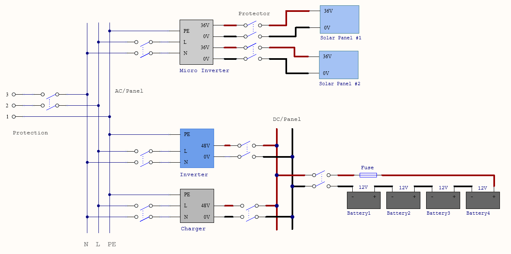

# Hardware Device Integration Prototyping (Tentative)

## Background

1. Goal
- Evaluate, setup, and run the corresponding platform/framework open source project.
- Evaluate and integrate vendors' devices.
- Identify problem statements bottom up using ORES detailed design perspective.
2. Scope and Condition
- Focus on residential energy management currently. 
- Start with specific requirement per system for the first phase. 
3. Design and Implementation Iteration Phases
- Hardware devices from major vendor, energy optimization implementation between generation, storage, and consumption, within a house (supercharge solar).
- Hardware devices from multiple vendors, within a house.
- Optimization with grid-tie (time-based control, VPP), between houses.

## Prototyping System Diagram

## Energy Power Plane (perspective)

1. **Generation**: Mainly the solar panel with micro inverter. Current standard configuration is one micro inverter (2kW) with 4 solar panels (500W each).
2. **Storage**: Either an all-in-one “device centric” solution, such as a portable power station, or the “system centric” solution consisting of a battery module utilizing the BMS (Battery Management System), PCS (Power Conversion System), and ESS(Energy Storage System). The former is more convenient to install, but may not fully support external communication. The latter has better support for external communications, especially with EMS. The ESS is the major concern of the prototype.
3. **Consumption**: Some appliances can communicate with home automation platforms while others may not. In this case, we need smart plug to collect information from.
4. **Grid**: In order to feed power energy back to grid, it is necessary to meet local regulations/qualifications. For the time being, we may need to limit the power energy feed into the grid.
5. **Smart Electric Panel**: Mainly the AC bus is represented here, one of the major important pieces of the system.
6. **Smart Plug, Smart Meter**: To collect appliance and home power related metrics. This will make energy management and optimization more efficient for the system.

## Control and Management Plane (perspective)

1. Home Automation Platform/Framework
- Home Assistant: Active open source project，implemented with Python，on a Raspberry Pi. Support Matter, Zigbee, Thread, etc. From user’s standpoint, the most of its beauty is its “software defined” or “intent based” feature. For home EMS，the home automation platform might be the most fundamental part.
 - OpenEMS: implemented with Java, started by FENECON GmbH.
 - Amazon Alexa, Apple HomeKit, Google Nest, etc.
2. Communication Standard: Zigbee, Matter, Thread, S2.
3. Integration and Add-on: For the Home Assistant, Integration subsists of pieces of software that connect to other software and platforms. Add-ons can provide additional functionality. For example, we can extend the S2 Resource Manager functionality.
3. Automation and Script: Automation in Home Assistant allows you to automatically respond to real-time events. Similar to automation, scripts are replicable actions that can be run with minimal user oversight. For the prototype, we will utilize these primitives to implement basic energy flexibility scenarios.

## Energy Flexibility Scenario

1. Supercharge Solar: Utilize the energy generated by solar as much as possible.
2. Time-based Control: Optimize the energy usage based around peak usage periods and price of the electricity to save the user money.
3. S2: Provide eight flexibility patterns and five control types.

## Problem Statement (bottom up) 

Within the context of the prototyping phase#1 plan and implementation,  we will base our prototyping on the home automation platform. We can leverage existing mechanisms, and may not need to implement much. We expect to develop and implement solutions to the following two problems to be described with S2 terms:
1. With Resource Manager (RM): An adaption layer abstraction and standardization between the CEM (standard) communication protocol and the lower layer (inner, propriety) protocol of different ESS devices.
2. With Customer Energy Manager (CEM): Abstraction and standardization to support energy flexibility scenarios by implementation.

## Phase#1 Implementation

1. Hardware Devices (vendor, spec, protocol/api, cost, etc.)
- Solar Panel
- Micro Inverter
- Battery Module with BMS
- PCS or Power Station
- Electric Panel
- Smart Plug and Smart Meter
- Raspberry PI
- Accessories
2. Software Development
- Data collection, monitor and analysis
- Devices adaption, resource manager with ESS
- Scenario automation and script
3. System Integration, Testing and Operation
  
## Progress Update

May 15th, 2024

1. Main focus of the fundamental prototyping system setup in Shanghai lab is with the control plane part based on Home Assistant, including Raspberry Pi, smart meter/plug, voltage and temperature sensors, switch/relay, etc. The power plane experiment is relative preliminary, mainly ESS with separate inverter and charger configuration.
2. For California lab  setup, the target is to extend the power plane part. First is 1-4 solar panels about 400W each, with micro inverter  around 1-2kW outdoor better with WiFi. The second is the ESS with lead acid battery at the beginning for safety reason, and with the power limiter for the inverter, WiFi support required. 
3. Use US standard instead for smart meter/plug, accessories, etc. 
4. For bidirectional AC power flow detection, the voltage sensor is required in addition to the current sensor, since the direction is calculated by the phase difference. We met some issue with some smart power meter.  It works well with its app, it needs to have direction indication with Home Assistant as well.
5. For current setup we use the AC couple solution for simplicity reason, it means we need two separate inverters. We plan next version or setup to be able to use DC couple solution (solar MPPT battery DC charger) as well. 

May 22th, 2024
- grammer and wording edits
